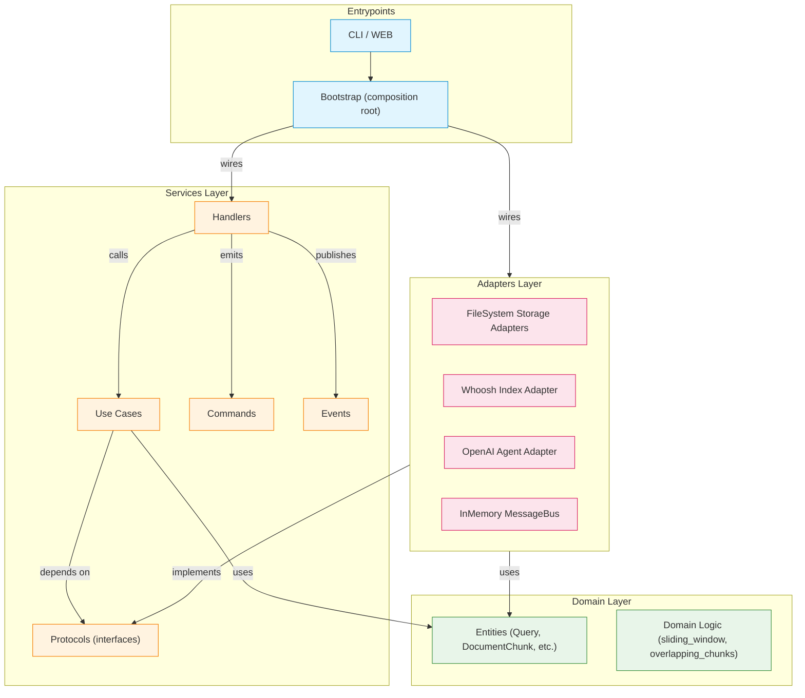
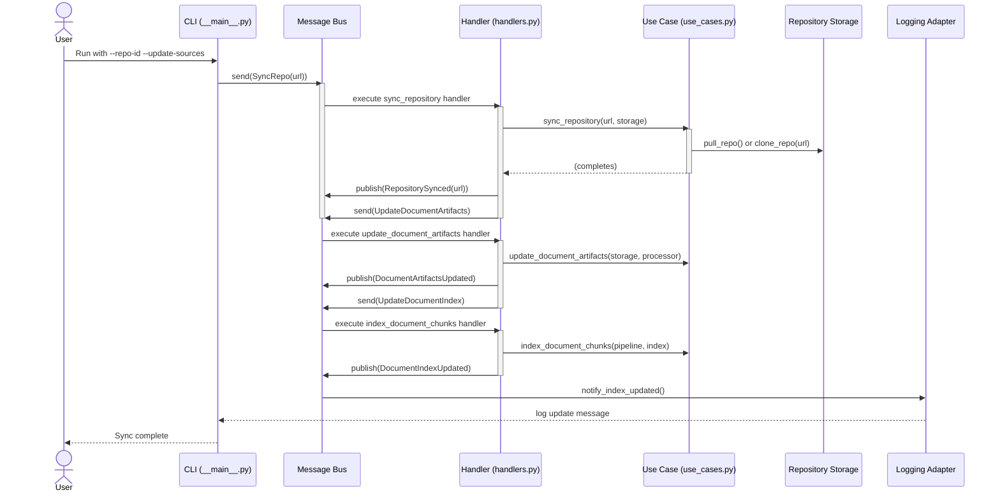
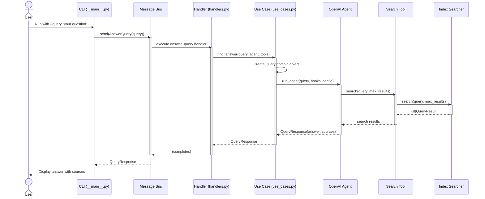

# High-level Structure

The overall design was inspired by common principles used in
hexagonal/onion/clean architectures, DDD and CQRS, with a message bus
being used for command/event dispatch.

A Mermaid representation of the dependency graph:

## Repository Structure

### Main package

The package root is `src/docs_buddy`

The structure underneath is as follows:

- **domain** - core entities and domain logic
- **services** - use cases, handlers, adapter protocols, commands & events
- **adapters** - concrete implementation of the adapter protocols
- **entrypoints** - CLI, web, composition root

### Tests

Tests are structured as follows:

- **unit** - domain & service functionality, isolated components
- **integration** - functionality cutting across architectural layers
- **e2e** - functionality exposed at the endpoints

## Key flows

### Fetching documentation

### Answering user queries

